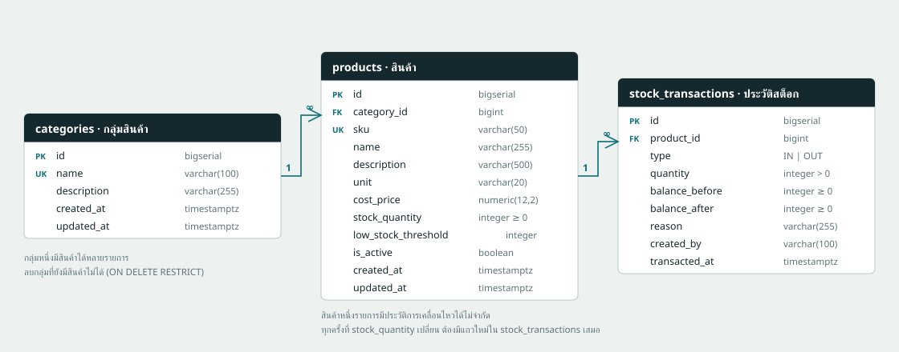
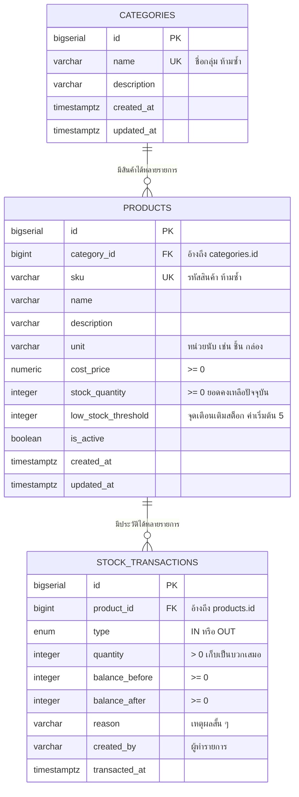

# โครงสร้างฐานข้อมูล (ER Diagram)

ระบบใช้ PostgreSQL 3 ตารางหลัก ความสัมพันธ์เป็นแบบ One-to-Many ทั้งสองเส้น

## ความสัมพันธ์

| ความสัมพันธ์ | ชนิด | กฎเมื่อลบต้นทาง | เหตุผล |
|---|---|---|---|
| `categories` → `products` | One-to-Many | `ON DELETE RESTRICT` | ลบกลุ่มที่ยังมีสินค้าอยู่ไม่ได้ กันสินค้ากำพร้า |
| `products` → `stock_transactions` | One-to-Many | `ON DELETE RESTRICT` | ประวัติสต็อกเป็นหลักฐานทางบัญชี ห้ามหายไปพร้อมสินค้า |

สินค้า 1 รายการอยู่ได้กลุ่มเดียว (`category_id` เป็น `NOT NULL`) และมีรายการเคลื่อนไหวได้ไม่จำกัด

## คำอธิบายตาราง

### categories — กลุ่มสินค้า
ใช้จัดหมวด เช่น IT, Office Supply, Furniture ชื่อกลุ่มถูกบังคับให้ไม่ซ้ำด้วย `UNIQUE`

### products — สินค้า
หนึ่งแถวคือหนึ่ง SKU

- `sku` เป็น `UNIQUE` เพื่อกันการสร้างสินค้าซ้ำ
- `stock_quantity` มี `CHECK (stock_quantity >= 0)` เป็นด่านสุดท้ายที่ระดับฐานข้อมูล ต่อให้โค้ดพลาดก็ติดลบไม่ได้
- `low_stock_threshold` ทำให้ตั้งจุดเตือนต่างกันได้รายสินค้า เช่น กระดาษ A4 เตือนที่ 10 ห่อ แต่โน้ตบุ๊กเตือนที่ 3 เครื่อง ค่าเริ่มต้นคือ 5 ตามโจทย์
- `is_active` ใช้ปิดการใช้งานแทนการลบ เพื่อไม่ให้ประวัติเสียหาย

### stock_transactions — ประวัติการเคลื่อนไหวสต็อก
ตารางนี้เป็น append-only ledger เขียนอย่างเดียว ไม่แก้ไขย้อนหลัง

- `type` เป็น enum `IN` / `OUT` ส่วน `quantity` เก็บเป็นจำนวนบวกเสมอ ทิศทางอ่านจาก `type` วิธีนี้ทำให้รวมยอดรับเข้า/ตัดออกแยกกันได้ง่ายกว่าเก็บเป็นเลขติดลบ
- `balance_before` และ `balance_after` เก็บยอดคงเหลือ ณ ขณะนั้น ทำให้ตรวจสอบย้อนหลังได้ว่ายอดปัจจุบันมาจากรายการใดบ้าง โดยไม่ต้องไล่รวมทั้งตาราง
- ทุกครั้งที่ `products.stock_quantity` เปลี่ยน จะต้องมีแถวใหม่ที่นี่เสมอ ทั้งสองอย่างเขียนใน transaction เดียวกัน

## ดัชนี (Index) ที่สร้างไว้

| ดัชนี | ตาราง | ใช้กับ |
|---|---|---|
| `idx_products_category` | products | กรองสินค้าตามกลุ่ม |
| `idx_products_name` | products | ค้นหาด้วยชื่อ (เก็บเป็น `lower(name)`) |
| `idx_products_low_stock` | products | รายงานสินค้าใกล้หมด (partial index เฉพาะที่ `is_active = TRUE`) |
| `idx_tx_product_time` | stock_transactions | ดูประวัติของสินค้าชิ้นเดียวเรียงตามเวลา |
| `idx_tx_time` | stock_transactions | ดูประวัติทั้งระบบล่าสุดก่อน |

## ความถูกต้องของข้อมูลสต็อก

การปรับสต็อกทุกครั้งทำงานตามลำดับนี้ภายใน transaction เดียว

1. `SELECT ... FOR UPDATE` ล็อกแถวสินค้า กันกรณีมีหลาย request ตัดสต็อกก้อนเดียวกันพร้อมกัน
2. คำนวณยอดใหม่ ถ้าติดลบให้ตอบ `409 INSUFFICIENT_STOCK` แล้ว rollback
3. `UPDATE products.stock_quantity`
4. `INSERT INTO stock_transactions`
5. `COMMIT`

ถ้าขั้นตอนใดล้มเหลว ระบบจะ rollback ทั้งชุด ยอดคงเหลือกับประวัติจึงตรงกันเสมอ
